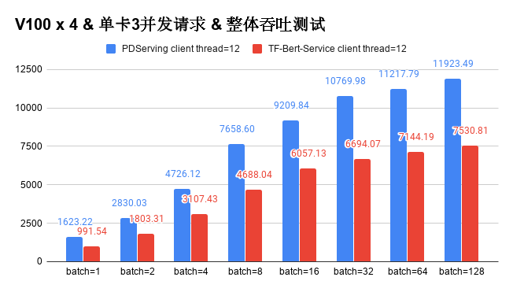

## Build Bert-As-Service in 10 minutes

([简体中文](./BERT_10_MINS_CN.md)|English)

The goal of Bert-As-Service is to give a sentence, and the service can represent the sentence as a semantic vector and return it to the user. [Bert model](https://arxiv.org/abs/1810.04805) is a popular model in the current NLP field. It has achieved good results on a variety of public NLP tasks. The semantic vector calculated by the Bert model is used as input to other NLP models, which will also greatly improve the performance of the model. Bert-As-Service allows users to easily obtain the semantic vector representation of text and apply it to their own tasks. In order to achieve this goal, we have shown in five steps that using Paddle Serving can build such a service in ten minutes. All the code and files in the example can be found in [Example](https://github.com/PaddlePaddle/Serving/tree/develop/python/examples/bert) of Paddle Serving.

If your python version is 3.X, replace the 'pip' field in the following command with 'pip3',replace 'python' with 'python3'.

### Step1: Getting Model

#### method 1:
This example use model [BERT Chinese Model](https://www.paddlepaddle.org.cn/hubdetail?name=bert_chinese_L-12_H-768_A-12&en_category=SemanticModel) from [Paddlehub](https://github.com/PaddlePaddle/PaddleHub).

Install paddlehub first
```
pip install paddlehub
```

run 
```
python prepare_model.py 128
```

**PaddleHub only support Python 3.5+**

the 128 in the command above means max_seq_len in BERT model, which is the length of sample after preprocessing.
the config file and model file for server side are saved in the folder bert_seq128_model.
the config file generated for client side is saved in the folder bert_seq128_client.

#### method 2:
You can also download the above model from BOS(max_seq_len=128). After decompression, the config file and model file for server side are stored in the bert_chinese_L-12_H-768_A-12_model folder, and the config file generated for client side is stored in the bert_chinese_L-12_H-768_A-12_client folder:
```shell
wget https://paddle-serving.bj.bcebos.com/paddle_hub_models/text/SemanticModel/bert_chinese_L-12_H-768_A-12.tar.gz
tar -xzf bert_chinese_L-12_H-768_A-12.tar.gz
mv bert_chinese_L-12_H-768_A-12_model bert_seq128_model
mv bert_chinese_L-12_H-768_A-12_client bert_seq128_client
```

### Step2: Getting Dict and Sample Dataset

```
sh get_data.sh
```
this script will download Chinese Dictionary File vocab.txt and Chinese Sample Data data-c.txt


### Step3: Launch Service

start cpu inference service,Run
```
python -m paddle_serving_server.serve --model bert_seq128_model/ --port 9292  #cpu inference service
```
Or,start gpu inference service,Run
```
python -m paddle_serving_server.serve --model bert_seq128_model/ --port 9292 --gpu_ids 0 #launch gpu inference service at GPU 0
```
| Parameters | Meaning                                  |
| ---------- | ---------------------------------------- |
| model      | server configuration and model file path |
| thread     | server-side threads                      |
| port       | server port number                       |
| gpu_ids    | GPU index number                         |

### Step4: data preprocessing logic on Client Side

Paddle Serving has many built-in corresponding data preprocessing logics. For the calculation of Chinese Bert semantic representation, we use the ChineseBertReader class under paddle_serving_app for data preprocessing. Model input fields  of multiple models corresponding to a raw Chinese sentence can be easily fetched by developers

Install paddle_serving_app

```shell
pip install paddle_serving_app
```

### Step5: Client Visit Serving


#### method 1: RPC Inference

Run
```
head data-c.txt | python bert_client.py --model bert_seq128_client/serving_client_conf.prototxt
```

the client reads data from data-c.txt and send prediction request, the prediction is given by word vector. (Due to massive data in the word vector, we do not print it).


#### method 2: HTTP Inference

This method is divided into two steps: 

1. Start an HTTP prediction server.

start cpu HTTP inference service,Run
```
 python bert_web_service.py bert_seq128_model/ 9292 #launch cpu inference service
```

Or,start gpu HTTP inference service,Run
```
 export CUDA_VISIBLE_DEVICES=0,1
```
set environmental variable to specify which gpus are used, the command above means gpu 0 and gpu 1 is used.
```
 python bert_web_service_gpu.py bert_seq128_model/ 9292 #launch gpu inference service
```

2. Prediction via HTTP request
```
curl -H "Content-Type:application/json" -X POST -d '{"feed":[{"words": "hello"}], "fetch":["pooled_output"]}' http://127.0.0.1:9292/bert/prediction
```


### Benchmark

We tested the performance of Bert-As-Service based on Padde Serving based on V100 and compared it with the Bert-As-Service based on Tensorflow. From the perspective of user configuration, we used the same batch size and concurrent number for stress testing. The overall throughput performance data obtained under 4 V100s is as follows.



<!--
yum install -y libXext libSM libXrender
pip install paddlehub paddle_serving_server paddle_serving_client
sh pip_app.sh
python bert_10.py
sh server.sh &
wget https://paddle-serving.bj.bcebos.com/bert_example/data-c.txt --no-check-certificate
head -n 500 data-c.txt > data.txt
cat data.txt | python bert_client.py
if [[ $? -eq 0 ]]; then
    echo "test success"
else
    echo "test fail"
fi
ps -ef | grep "paddle_serving_server" | grep -v grep | awk '{print $2}' | xargs kill
-->
